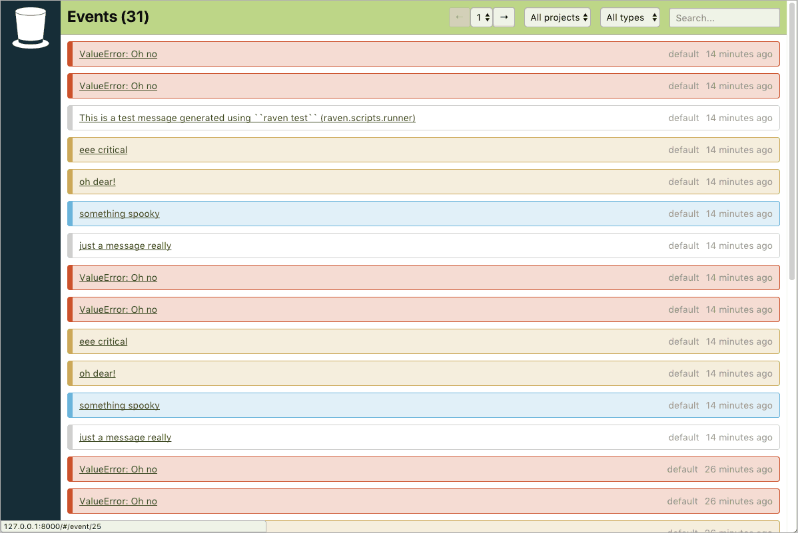
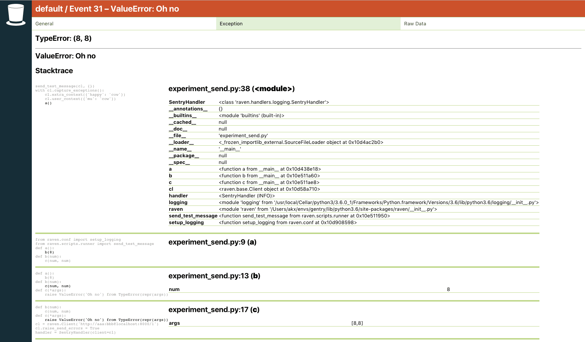

  

Gentry
======

A splendidly simple Django-based implementation of a [Raven][raven] receiver.
For small-time users with reasonable event counts – when you don't need most
of what [Sentry][sentry] provides, but want to keep track of your exceptions.

:exclamation: Please don't try to make Gentry scale – just switch to Sentry!

[raven]: https://docs.sentry.io/clients/python/
[sentry]: https://sentry.io/

Requirements
------------

* Python 3
* A database supported by Django: MySQL/SQLite/PostgreSQL

Installation
------------

* Set up a virtualenv and install the contents of `requirements.txt` in it.
* `cd gontend; npm; npm run build` (or `yarn; yarn build`).
* Configure a database URL into the envvar `DATABASE_URL`.
* Either set the envvar `GOTIFY_IMMEDIATE` to true or
  set up Cron to run the `gotify_send` management command.
* Run migration using `migrate`.
* Create an user using the `createsuperuser` management command.
* Point a WSGI server to serve Gentry. No need to `collectstatic`!

Screenshots
-----------

### Event list

### Exception detail

